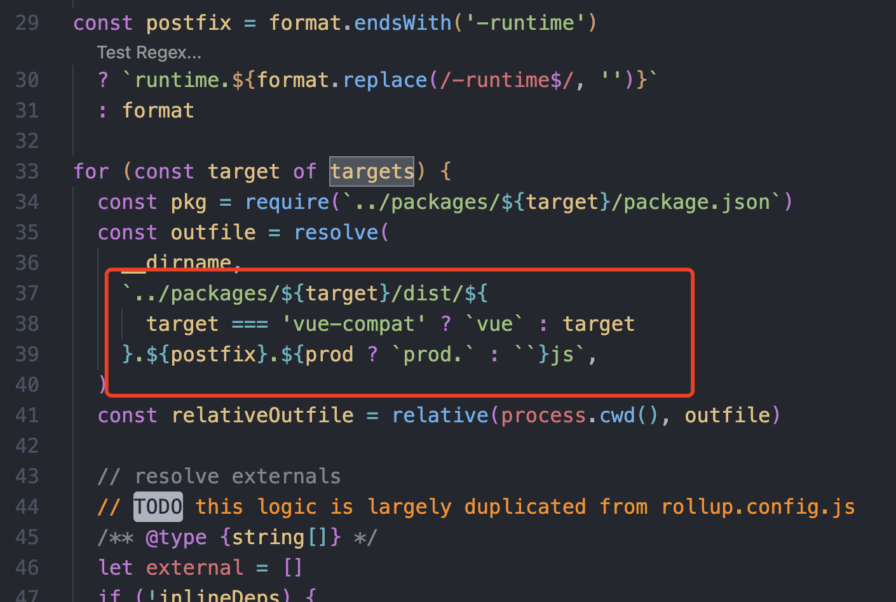

## 1、源码下载

Vue3源码托管在Github上，[github 源码地址](https://github.com/vuejs/core)

github 目前容易被墙，可以配置host

```text
140.82.112.4 github.com
```
推荐 [SwitchHosts](https://switchhosts.vercel.app/zh) 这个软件修改 host 文件，

网络通畅之后克隆源码到本地目录即可


## 2、开启调试

以前的 Vue 本地调试源码需要自己手动添加 --sourcemap，最新版本 dev 命令默认开启了 sourcemap，不需要额外配置。

如图，如果构建命令 `pnpm dev` 没有携带target参数，那么默认构建vue，得到如下路径的产物
`packages/vue/dist/vue.global.js`, 我们新建一个html文件，引入这个 `js` 文件，就可以在浏览器中调试了。



