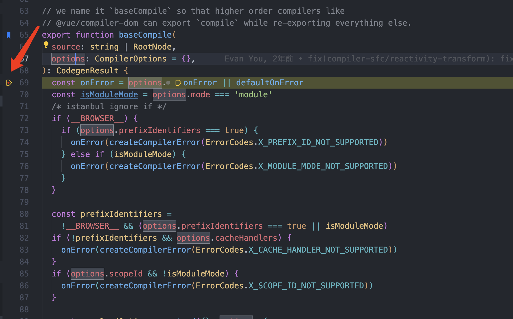

## 1、源码下载

Vue3源码托管在Github上，[github 源码地址](https://github.com/vuejs/core)

github 目前容易被墙，可以配置host

```text
140.82.112.4 github.com
```
推荐 [SwitchHosts](https://switchhosts.vercel.app/zh) 这个软件修改 host 文件，

网络通畅之后克隆源码到本地目录即可


## 2、开启调试

以前的 Vue 本地调试源码需要自己手动添加 --sourcemap，最新版本 dev 命令默认开启了 sourcemap，不需要额外配置。

如图，如果构建命令 `pnpm dev` 没有携带target参数，那么默认构建vue，得到如下路径的产物
`packages/vue/dist/vue.global.js`, 我们新建一个html文件，引入这个 `js` 文件，就可以在浏览器中调试了。


但是浏览器调试太麻烦，我们还是希望用 vscode 进行调试，首先安装 vscode 插件 Live Server，右键上述生成的 html 文件，选择 `Open with Live Server` 即可。

html 的文件路径：core/demo/index.html

完整的 html 文件如下：

```html
<!DOCTYPE html>
<html lang="en">
<head>
  <meta charset="UTF-8">
  <meta name="viewport" content="width=device-width, initial-scale=1.0">
  <title>Document</title>
</head>

<body>
<script src="../packages/vue/dist/vue.global.js"></script>  


<div id="app">
  <h1>我的 vue 调试</h1>
  {{name}}
  <div v-for="item in list" :key="item">{{item}}</div>
  <button @click="insert">超市</button></button>
  <my-component></my-component>
</div>

 <script>
  const {createApp,ref} = Vue
  const app = createApp({

    setup() {
      const list = ref([1,2,3])
      function insert() {
        list.value.splice(1,0,66)
      }
      return {
        name: 'lxf',
        list,
        insert
      }
    }
  })
  app.component('my-component', {
    template: '<div>这是我的组件</div>'
  })
  app.mount('#app')
 </script>
</body>
</html>
```

打开浏览器，输入 `http://localhost:5500/demo/index.html` 即可看到效果。

vscode launch.json 配置如下：

```json
{
  // Use IntelliSense to learn about possible attributes.
  // Hover to view descriptions of existing attributes.
  // For more information, visit: https://go.microsoft.com/fwlink/?linkid=830387
  "version": "0.2.0",
  "configurations": [
    // !!这段配置是调试 vue 源码的配置
    {
      "type": "chrome",
      "name": "debugvue",
      "request": "launch",
      "url": "http://localhost:5500/demo/index.html"
    },
    {
      "type": "node",
      "request": "launch",
      "name": "Vitest - Debug Current Test File",
      "autoAttachChildProcesses": true,
      "skipFiles": ["<node_internals>/**", "**/node_modules/**"],
      "program": "${workspaceRoot}/node_modules/vitest/vitest.mjs",
      "args": ["run", "${relativeFile}"],
      "smartStep": true,
      "console": "integratedTerminal"
    }
  ]
}

```

点击 vscode 的调试，就能在 vscode 中断点调试了。

调试效果图：




