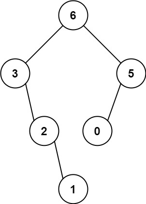
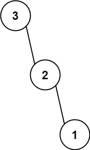

# 8、最大二叉树

LeetCode 654. [最大二叉树](https://leetcode-cn.com/problems/maximum-binary-tree/)


## 题目


给定一个不重复的整数数组 nums 。 最大二叉树 可以用下面的算法从 nums 递归地构建:

创建一个根节点，其值为 nums 中的最大值。
递归地在最大值 左边 的 子数组前缀上 构建左子树。
递归地在最大值 右边 的 子数组后缀上 构建右子树。
返回 nums 构建的 最大二叉树 。


### 示例 1：



输入：nums = [3,2,1,6,0,5]
输出：[6,3,5,null,2,0,null,null,1]
解释：递归调用如下所示：
- [3,2,1,6,0,5] 中的最大值是 6 ，左边部分是 [3,2,1] ，右边部分是 [0,5] 。
    - [3,2,1] 中的最大值是 3 ，左边部分是 [] ，右边部分是 [2,1] 。
        - 空数组，无子节点。
        - [2,1] 中的最大值是 2 ，左边部分是 [] ，右边部分是 [1] 。
            - 空数组，无子节点。
            - 只有一个元素，所以子节点是一个值为 1 的节点。
    - [0,5] 中的最大值是 5 ，左边部分是 [0] ，右边部分是 [] 。
        - 只有一个元素，所以子节点是一个值为 0 的节点。
        - 空数组，无子节点。
  
### 示例 2：



输入：nums = [3,2,1]
输出：[3,null,2,null,1]


**提示：**

- 1 <= nums.length <= 1000
- 0 <= nums[i] <= 1000
- nums 中的所有整数 互不相同


## 解析思路
- 找到数组中的最大值 root，最大值左边的元素都是左子树，右边的都是右子树
- 左右子树分别递归，挂载到 root 底下

```js
var constructMaximumBinaryTree = function(nums) {
  return build(nums, 0, nums.length - 1);
}
var build = function(nums, lo, hi) {
  // 递归中之条件
  if (lo > hi) {
    return null;
  }

  // 找到数组中的最大值和对应的索引
  var index = -1, maxVal = -Infinity;
  // 在指定区间内 找到最大值和索引
  for (var i = lo; i <= hi; i++) {
    if (maxVal < nums[i]) {
      index = i;
      maxVal = nums[i];
    }
  }
  // 创建树节点
  var root = new TreeNode(maxVal);
  // 递归调用构造左右子树
  root.left = build(nums, lo, index - 1);
  root.right = build(nums, index + 1, hi);

  return root;
}
```