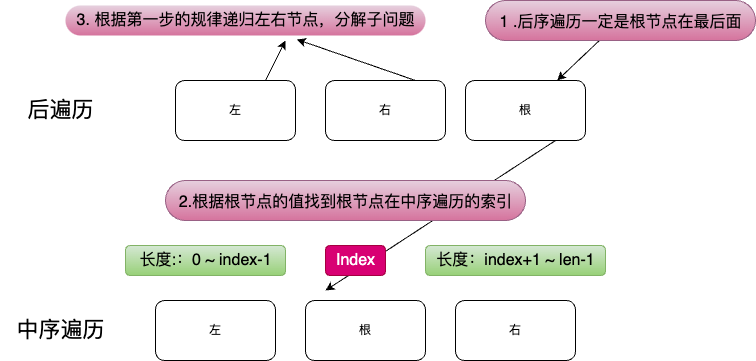

# 二叉树构造

## 1、从前序与中序遍历序列构造二叉树

Leetcode 105. [从前序与中序遍历序列构造二叉树](https://leetcode-cn.com/problems/construct-binary-tree-from-preorder-and-inorder-traversal/)


给定两个整数数组 preorder 和 inorder ，其中 preorder 是二叉树的先序遍历， inorder 是同一棵树的中序遍历，请构造二叉树并返回其根节点。


示例 1:


```
输入: preorder = [3,9,20,15,7], inorder = [9,3,15,20,7]
输出: [3,9,20,null,null,15,7]
```

示例 2:

```
输入: preorder = [-1], inorder = [-1]
输出: [-1]
```
 

提示:

- 1 <= preorder.length <= 3000
- inorder.length == preorder.length
- 3000 <= preorder[i], inorder[i] <= 3000
- preorder 和 inorder 均 无重复 元素
- inorder 均出现在 preorder
- preorder 保证 为二叉树的前序遍历序列
- inorder 保证 为二叉树的中序遍历序列

**题目分析**

首先我们要知道前序遍历和中序遍历的特点：

1. 前序遍历的第一个节点是根节点
2. 中序遍历的根节点左边是左子树，右边是右子树
3. 通过中序遍历的根节点，我们可以知道左子树的节点个数，右子树的节点个数

具体可以画图来看，比如下面这个例子：


**解题思路**


```
有二叉树如下：

前序遍历 preorder = [3,9,20,15,7]

中序遍历 inorder  = [9,3,15,20,7]
```

1. 前序遍历第一个节点一定是根节点，也就是 preorder 的 3 一定是第一个节点，
2. 但是通过前序遍历我们无法知道左右子树的分界点，这时候中序遍历的作用就体现出来了，节点 3 是根节点，在中序遍历里面， 3 的左边是左子树，右边是右子树，
3. 通过中序遍历我们可以知道左子树的节点个数，前序遍历我们可以确定根节点
4. 得到子问题左右子树，递归处理，关键点在于如何确定左右子树的范围，答案是通过左右子树的长度去解决

**代码实现**

```js
var buildTree = function (preorder, inorder) {
  // 1. 把需要寻找的数组用 Map 记录 映射关系为：值 => 索引，
  // 因为可以从 preOrder 获取根节点，inOrder 肯定在中间，需要找到中间索引，做一个值的映射更好找一些
  const inOrderMap = new Map();
  for (let i = 0; i < inorder.length; i++) {
    inOrderMap.set(inorder[i], i);
  }

  function build(preL, preR, inL, inR) {
    // 递归停止条件
    if (preL > preR || inL > inR) return null;
    // 头节点的值
    const rootValue = preorder[preL];
    // rootValue 在 inOrder 的位置
    const inorderRootIndex = inOrderMap.get(rootValue);
    // 左子树长度
    const leftSize = inorderRootIndex - inL;
    // 递归 左右子树 找到对应的 preOrder 和 inOrder 分解为子问题
    // preL 是根节点 需要 +1 获取子树起点
    const left = build(preL + 1, preL + leftSize, inL, inorderRootIndex - 1);
    const right = build(preL + leftSize + 1, preR, inorderRootIndex + 1, inR);
    // 返回递归后的头节点，并挂载左右子树
    return new TreeNode(rootValue, left, right);
  }
  return build(0, preorder.length - 1, 0, preorder.length - 1);
};

```
## 2、从中序与后序遍历序列构造二叉树

Leetcode 106. [从中序与后序遍历序列构造二叉树](https://leetcode-cn.com/problems/construct-binary-tree-from-inorder-and-postorder-traversal/)


给定两个整数数组 inorder 和 postorder ，其中 inorder 是二叉树的中序遍历， postorder 是同一棵树的后序遍历，请你构造并返回这颗 二叉树 。

 

示例 1:


输入：inorder = [9,3,15,20,7], postorder = [9,15,7,20,3]
输出：[3,9,20,null,null,15,7]
示例 2:

输入：inorder = [-1], postorder = [-1]
输出：[-1]
 

提示:

- `1 <= inorder.length <= 3000`
- `postorder.length == inorder.length`
- `-3000 <= inorder[i], postorder[i] <= 3000`
- `inorder 和 postorder 都由 不同 的值组成`
- `postorder 中每一个值都在 inorder 中`
- `inorder 保证是树的中序遍历`
- `postorder 保证是树的后序遍历`

**题目分析**

题目和上一题后序遍历比较相似

**图解**



**代码实现**

```js
var buildTree = function (inorder, postorder) {
  // 做一个查找映射
  const inOrderIndexMap = new Map();

  for (let i = 0; i < inorder.length; i++) {
    inOrderIndexMap.set(inorder[i], i);
  }

  // 分解子问题，得到数组节点
  function build(inL, inR, poL, poR) {
    // 终止条件是数组越界
    if (inL > inR || poL > poR) return null;
    // 根据后序遍历的最后一个节点，确定根节点
    const root = postorder[poR];
    // 找到根节点索引 后序遍历最后一个
    const inorderRootIndex = inOrderIndexMap.get(root);
    // 左子树长度
    const leftTreeSize = inorderRootIndex - inL;
    // 递归左右子树，关键是确定左右子树的范围
    const leftTree = build(
      inL,
      inL + leftTreeSize - 1,
      poL,
      poL + leftTreeSize - 1
    );
    const rightTree = build(
      inorderRootIndex + 1,
      inR,
      poL + leftTreeSize,
      poR - 1
    );
    // 返回根节点
    return new TreeNode(root, leftTree, rightTree);
  }
  return build(0, inorder.length - 1, 0, postorder.length - 1);
};
```


## 3、根据前序和后序遍历构造二叉树

LeetCode 889. [根据前序和后序遍历构造二叉树](https://leetcode-cn.com/problems/construct-binary-tree-from-preorder-and-postorder-traversal/)


给定两个整数数组 preorder 和 postorder ，其中 preorder 是二叉树的前序遍历， postorder 是同一棵树的后序遍历，请你构造并返回这棵 二叉树 。

示例 1:


输入：preorder = [1,2,4,5,3,6,7], postorder = [4,5,2,6,7,3,1]
输出：[1,2,3,4,5,6,7]

示例 2:

输入: preorder = [1], postorder = [1]
输出: [1]


提示：

- `1 <= preorder.length <= 30`
- `1 <= preorder[i] <= preorder.length`
- `preorder 中所有值都 不同`
- `postorder.length == preorder.length`
- `1 <= postorder[i] <= postorder.length`
- `postorder 中所有值都 不同`
- `保证 preorder 和 postorder 是同一棵二叉树的前序遍历和后序遍历`

**题目分析**

和上一题有些区别，前序遍历的第一个节点是根节点，后序遍历的最后一个节点是根节点，需要调整一下思路，在 inorder 中找到左子树的第一元素，在 postorder 中则是最后一个，找到 postorder 对应的 index，就能知道左子树的长度，然后递归处理左右子树；也可以找到右子树长度，然后递归处理左右子树，这是两种不同的答案。

**图解**


根据上图我们能确定左子树的长度，也能确定右子树的长度，然后递归处理左右子树。

```js
/**
 * @param {number[]} preorder
 * @param {number[]} postorder
 * @return {TreeNode}
 */
var constructFromPrePost = function (preorder, postorder) {
  // 依然是把后序遍历数组用 Map 记录 映射关系为：值 => 索引，
  // 因为可以从 preOrder 获取左子树根节点位置
  const postOrderMapIndex = new Map();

  for (let i = 0; i < postorder.length; i++) {
    postOrderMapIndex.set(postorder[i], i);
  }

  function build(preL, preR, postL, postR) {
    // 递归停止条件
    if (preL > preR || postL > postR) return null;
    // 如果相等，说明没有子节点
    if (preL === preR) return new TreeNode(preorder[preL]);
    // 前序遍历左子树的根节点
    const leftRoot = preorder[preL + 1];
    // 这个节点在后序遍历的位置
    const postLeftIndex = postOrderMapIndex.get(leftRoot);
    // 根据位置计算左子树的长度
    const leftSize = leftRoot ? postLeftIndex - postL + 1 : 0;

    // 递归构造子树
    const leftTree = build(preL + 1, preL + leftSize, postL, postLeftIndex);
    const rightTree = build(
      preL + leftSize + 1,
      preR,
      postLeftIndex + 1,
      postR - 1
    );

    return new TreeNode(preorder[preL], leftTree, rightTree);
  }

  return build(0, preorder.length - 1, 0, postorder.length - 1);
};
// @lc code=end

```