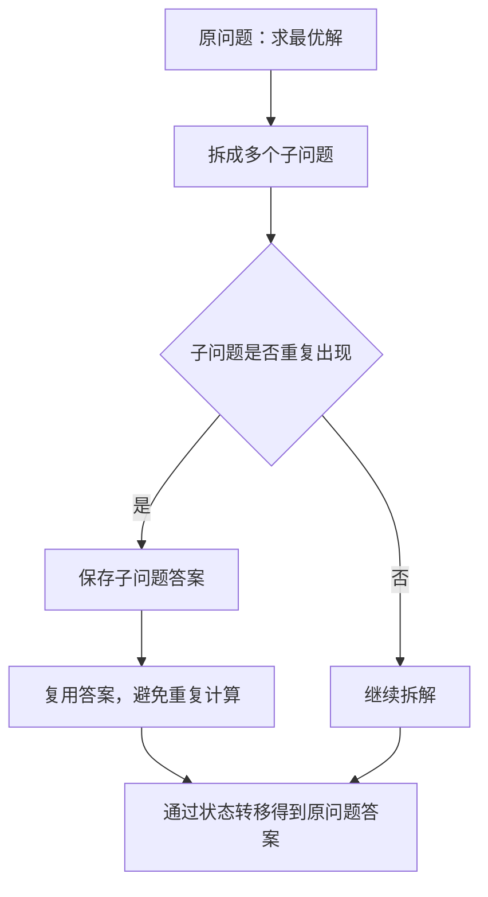
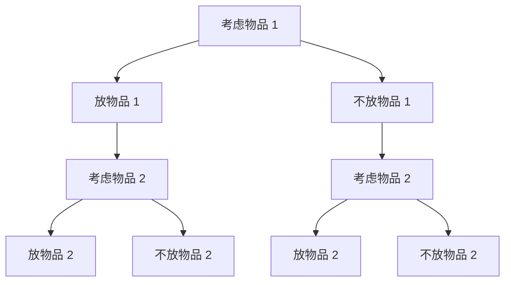
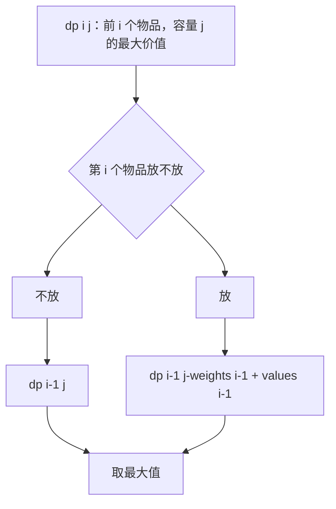

# 动态规划解题思路

## 动态规划解决什么问题

动态规划通常用来解决“求最优解”的问题，比如最长递增子序列、最长公共子序列、最短路径、背包问题等。

这类问题如果直接暴力枚举，思路通常很简单：把所有可能情况都算出来，再从里面选最大值或最小值。但是暴力枚举经常会遇到一个问题：**很多中间结果会被反复计算**。

动态规划做的事情，就是把这些重复出现的子问题保存下来。下次再需要同一个子问题的答案时，直接复用，不再重新计算。

可以把动态规划理解成这样：



所以动态规划的关键不是直接背公式，而是先想清楚：

- 暴力解法会怎么枚举所有可能？
- 枚举过程中哪些子问题会重复出现？
- 当前问题能不能由更小的子问题推出来？

## 动态规划的三个步骤

写动态规划一般先确定三件事：

1. **确定 `dp` 的含义**

   `dp` 数组一定要有明确含义。比如最长递增子序列：给定一个整数数组，找出其中最长严格递增子序列的长度。

   例如 `nums = [10, 9, 2, 5, 3, 7, 101, 18]`，其中一个最长递增子序列是 `[2, 3, 7, 101]`，长度是 `4`。

   在这个题目里，`dp[i]` 可以表示“以第 `i` 个元素结尾的最长递增子序列长度”。

   比如：

   - `dp[0] = 1`：以 `nums[0] = 10` 结尾，只有 `[10]`，长度是 `1`
   - `dp[1] = 1`：以 `nums[1] = 9` 结尾，前面的 `10` 比 `9` 大，不能接在 `9` 前面，所以只有 `[9]`，长度是 `1`

2. **确定基础状态**

   基础状态就是最小规模问题的答案。比如空数组、容量为 `0`、只考虑第一个元素等场景。

3. **确定状态转移方程**

   状态转移方程表示“当前问题如何从更小的子问题推出来”。这一步通常来自暴力枚举中的选择过程。

   还是用最长递增子序列举例。既然 `dp[i]` 表示“以第 `i` 个元素结尾的最长递增子序列长度”，那么想求 `dp[i]`，就要看前面哪些元素可以接到 `nums[i]` 前面。

   如果存在一个位置 `j < i`，并且 `nums[j] < nums[i]`，说明以 `nums[j]` 结尾的递增子序列，可以接上 `nums[i]`：

   ```js
   dp[i] = dp[j] + 1
   ```

   但前面可能有多个位置都能接到 `nums[i]` 前面，所以要取其中最大的结果：

   ```js
   dp[i] = Math.max(dp[i], dp[j] + 1)
   ```

**动态规划的核心：先理解暴力枚举，再从暴力枚举里找到重复子问题，最后把重复计算改成状态转移。**

## 背包问题背景

背包问题可以理解成一个选择问题。

假设有一个背包，它最多只能装 `bagW` 重量的物品。现在有一组物品，每个物品都有两个属性：

- `weights[i]`：第 `i` 个物品的重量
- `values[i]`：第 `i` 个物品的价值

目标是：**在不超过背包容量的前提下，选择一些物品，让总价值最大。**

比如：

```js
weights = [3, 4, 5]
values = [1, 3, 2]
bagW = 7
```

这表示：

| 物品 | 重量 | 价值 |
| --- | --- | --- |
| 物品 1 | 3 | 1 |
| 物品 2 | 4 | 3 |
| 物品 3 | 5 | 2 |

如果背包容量是 `7`，可以选择物品 1 和物品 2，总重量是 `3 + 4 = 7`，总价值是 `1 + 3 = 4`。

## 暴力解法

比如背包问题，我们要暴力穷举所有的组合场景，才能知道哪个答案是最佳。可以先用回溯枚举每个物品“放”和“不放”两种情况：

```js
/**
 * @param {number[]} weights
 * @param {number[]} values
 * @param {number} bagW
 */
var forcePackage = function(weights, values, bagW) {
  let maxValue = 0

  function backtrace(index, totalWeight, totalValue) {
    if (totalWeight > bagW) {
      return
    }

    if (index === weights.length) {
      maxValue = Math.max(maxValue, totalValue)
      return
    }

    // 不放当前物品
    backtrace(index + 1, totalWeight, totalValue)

    // 放当前物品
    backtrace(
      index + 1,
      totalWeight + weights[index],
      totalValue + values[index]
    )
  }

  backtrace(0, 0, 0)

  return maxValue
}
```

这段代码可以算出正确答案，但是每个物品都有“放”和“不放”两种选择，物品数量一多，枚举次数会快速增长。

动态规划要优化的，就是这些枚举过程中反复出现的子问题。比如考虑某个物品时，“剩余容量还能装多少价值”这个问题会被多次计算。

## 为什么暴力解法会重复

0/1 背包里，每个物品只有两种选择：

- 放进背包
- 不放进背包

所以暴力枚举会形成一棵选择树：



如果物品很多，选择分支会快速膨胀。`n` 个物品，每个物品都有选和不选两种情况，暴力解法最多要枚举 `2^n` 种组合。

而动态规划会换一个角度看问题：我不关心物品的选择顺序，只关心两个状态：

- 当前考虑到第几个物品
- 当前背包还允许多少容量

## 背包问题的状态转移

定义：

```js
dp[i][j]
```

表示：**只考虑前 `i` 个物品，背包容量为 `j` 时，能得到的最大价值。**

当我们考虑第 `i` 个物品时，当前物品在数组中的下标是 `i - 1`，只有两种情况。

第一种：不放第 `i` 个物品。

```js
dp[i][j] = dp[i - 1][j]
```

意思是：不放当前物品，那最大价值就等于“只考虑前 `i - 1` 个物品，容量仍然是 `j`”的答案。

第二种：放第 `i` 个物品。

```js
dp[i][j] = dp[i - 1][j - weights[i - 1]] + values[i - 1]
```

意思是：放当前物品，就要先给它腾出 `weights[i - 1]` 的容量，然后加上当前物品的价值。

两种情况取最大值：

```js
dp[i][j] = Math.max(
  dp[i - 1][j],
  dp[i - 1][j - weights[i - 1]] + values[i - 1]
)
```

比如求 `dp[2][7]`，表示“只考虑前 2 个物品，背包容量为 7 时，能得到的最大价值”。

此时第 2 个物品是：

- 重量：`weights[1] = 4`
- 价值：`values[1] = 3`

有两种选择：

- 不放第 2 个物品：答案就是 `dp[1][7]`，只考虑物品 1，容量是 `7`，最大价值是 `1`
- 放第 2 个物品：先给它腾出 `4` 的容量，剩余容量是 `7 - 4 = 3`，所以答案是 `dp[1][3] + 3 = 1 + 3 = 4`

所以：

```js
dp[2][7] = Math.max(dp[1][7], dp[1][3] + 3)
         = Math.max(1, 4)
         = 4
```

图解如下：



如果当前容量 `j` 小于第 `i` 个物品的重量，也就是 `j < weights[i - 1]`，说明这个物品放不进去，只能不放：

```js
dp[i][j] = dp[i - 1][j]
```

## 小结

动态规划不是直接套公式，而是从暴力枚举优化而来：

1. 暴力枚举所有选择。
2. 找到重复出现的子问题。
3. 定义 `dp` 表示子问题的答案。
4. 用状态转移方程把大问题拆成小问题。

背包问题里的核心选择就是：**当前物品放不放**。只要把“放”和“不放”两种情况想清楚，状态转移方程就自然出来了。
