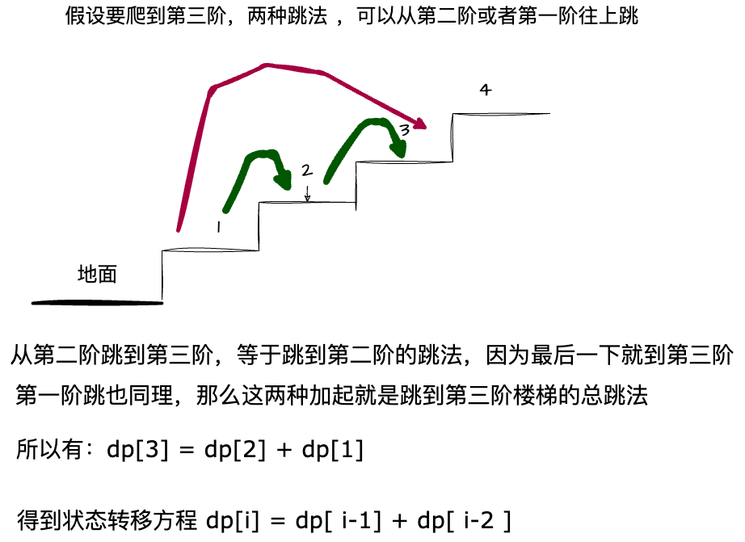

# 爬楼梯

**LeetCode 第 70 题，爬楼梯 [题目链接](https://leetcode-cn.com/problems/climbing-stairs/)。**


## 题目描述

假设你正在爬楼梯。需要 `n` 阶你才能到达楼顶。

每次你可以爬 `1` 或 `2` 个台阶。你有多少种不同的方法可以爬到楼顶呢？

 

示例 1：

```
输入：n = 2
输出：2
解释：有两种方法可以爬到楼顶。
1. 1 阶 + 1 阶
2. 2 阶
```

示例 2：

```
输入：n = 3
输出：3
解释：有三种方法可以爬到楼顶。
1. 1 阶 + 1 阶 + 1 阶
2. 1 阶 + 2 阶
3. 2 阶 + 1 阶
```

提示：

* `1 <= n <= 45`


## 题目分析

1. 题目中说的是每次爬 1 或者 2 阶楼梯
2. 每次爬的时候有两种选择
3. 假设我现在在第 N 阶楼梯，我可以从第 N-1 阶楼梯爬上来，也可以从第 N-2 阶楼梯爬上来，所有的可能只有这两个，如果没有 N-2，代表前面是第一阶，如果没有 N-1，代表当前是第一阶

## 图解




## 代码实现

```js
/**
 * @param {number} n
 * @return {number}
 */
var climbStairs = function (n) {
  // 设置每一阶梯的跳法
  const dp = [];
  // 第一阶 1
  dp[1] = 1;
  // 第二阶 2
  dp[2] = 2;
  // 从第三阶开始
  for (let i = 3; i <= n; i++) {
    // 当前阶梯的跳法等于前两阶梯的跳法之和
    dp[i] = dp[i - 1] + dp[i - 2];
  }
  // 返回第 n 阶的跳法
  return dp[n];
};
```
上面是标准的动态规划阶梯思路，但是我们可以看到，计算过后的 dp 数组中，我们只需要知道 dp[i - 1] 和 dp[i - 2] 的值，所以我们可以用两个变量来存储这两个值，这样就不需要额外的空间了。

```js
/**
 * @param {number} n
 * @return {number}
 */
var climbStairs = function (n) {
  if (n <= 1) return n;
  // 跳到第一阶的跳法 1
  let n1 = 1;
  let n2 = 2; // 跳到第二阶 2
  // 交换变量
  let t;
  for (let i = 3; i <= n; i++) {
    // 
    t = n1;
    // 阶梯往上走
    n1 = n2;
    // 往上走
    n2 = t + n2;
    // dp[i] = dp[i - 1] + dp[i - 2];
  }
  // 走到最后就是需要的步数
  return n2;
};
```

## 总结
可以看到，这题最终解法和斐波那契数列是一样的，只不过斐波那契数列是从 0 和 1 开始，而这题是从 1 和 2 开始，所以最终的结果是一样的。