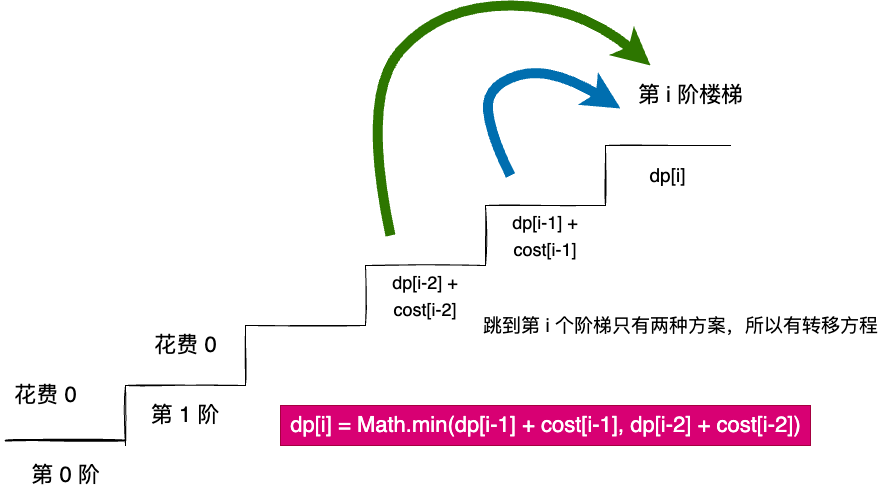

# 最小花费爬楼梯

LeetCode [746. 使用最小花费爬楼梯](https://leetcode-cn.com/problems/min-cost-climbing-stairs/)

给你一个整数数组 cost ，其中 cost[i] 是从楼梯第 i 个台阶向上爬需要支付的费用。一旦你支付此费用，即可选择向上爬一个或者两个台阶。

你可以选择从下标为 0 或下标为 1 的台阶开始爬楼梯。

请你计算并返回达到楼梯顶部的最低花费。

 

示例 1：
```
输入：cost = [10,15,20]

输出：15
解释：你将从下标为 1 的台阶开始。
- 支付 15 ，向上爬两个台阶，到达楼梯顶部。
总花费为 15 。
```
示例 2：
```
输入：cost = [1,100,1,1,1,100,1,1,100,1]
输出：6
解释：你将从下标为 0 的台阶开始。
- 支付 1 ，向上爬两个台阶，到达下标为 2 的台阶。
- 支付 1 ，向上爬两个台阶，到达下标为 4 的台阶。
- 支付 1 ，向上爬两个台阶，到达下标为 6 的台阶。
- 支付 1 ，向上爬一个台阶，到达下标为 7 的台阶。
- 支付 1 ，向上爬两个台阶，到达下标为 9 的台阶。
- 支付 1 ，向上爬一个台阶，到达楼梯顶部。
总花费为 6 。
 ```

提示：

- `2 <= cost.length <= 1000`
- `0 <= cost[i] <= 999`


## 题目解析
求最值问题，可以考虑动态规划。
很重要的一个题目意思：离开当前阶梯需要花费，但是到达其他阶梯是不需要花钱的。

设 dp[i] 表示爬到第 i 个阶梯的最小花费。

那么爬到第 i 个阶梯 只有有 i-1 的楼梯和 i-2。
如果从 i-1 的楼梯，那么 dp[i] = dp[i-1] + cost[i-1]
如果从 i-2 的楼梯，那么 dp[i] = dp[i-2] + cost[i-2]
我们从上面选中一个，取最小值。

所以 dp[i] = min(dp[i-1] + cost[i-1], dp[i-2] + cost[i-2])

初始值 dp[0] = cost[0]，dp[1] = cost[1]

最后返回 dp[cost.lenth-1] 即可。


图解：




## 代码实现


```js
/**
 * @param {number[]} cost
 * @return {number}
 */
var minCostClimbingStairs = function (cost) {
  // 代表到达当前楼梯需要的花费
  const dp = new Array(cost + 1).fill(Infinity);
  // 题目说可以从 0 或者 1 开始，所以这两个阶梯到达的时候都可以算 0
  // 这么考虑：如果从 0 开始，如果需要跳到 1，那为什么不直接从 1 开始，所以 0-1 这种跳法不存在
  // 因此初始化 dp
  dp[0] = 0;
  dp[1] = 0;
  for (let i = 2; i <= cost.length; i++) {
    dp[i] = Math.min(dp[i - 1] + cost[i - 1], dp[i - 2] + cost[i - 2]);
  }
  return dp[cost.length];
};
```

