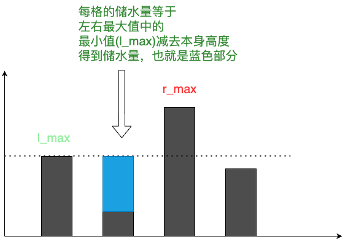

# 9、接雨水问题


LeetCode：[42. 接雨水](https://leetcode-cn.com/problems/trapping-rain-water/)

## 题目描述

给定 n 个非负整数表示每个宽度为 1 的柱子的高度图，计算按此排列的柱子，下雨之后能接多少雨水。


**示例 1：**


输入：`height = [0,1,0,2,1,0,1,3,2,1,2,1]`

输出：`6`

解释：上面是由数组 [0,1,0,2,1,0,1,3,2,1,2,1] 表示的高度图，在这种情况下，可以接 6 个单位的雨水（蓝色部分表示雨水）。 

**示例 2：**

输入：`height = [4,2,0,3,2,5]`

输出：`9`
 

**提示：**

- n == height.length
- 1 <= n <= 2 * 104
- 0 <= height[i] <= 105


## 解题思路

- 我们分析每个柱子能存储的水由什么决定，是比自己高的柱子包围起来
- 我们可以从左右两边开始，分别找出左右两边最高的柱子，找出较小那个高度，减去自身占用的高度，就是储水高度

来看一张图帮助理解：


::: code-group
```js [暴力解法]
/*
 * @lc app=leetcode.cn id=42 lang=javascript
 *
 * [42] 接雨水
 */

/**
 * @param {number[]} height
 * @return {number}
 */
var trap = function (height) {
  // 暴力解法
  // 每根柱子能装多少水 取决于左右两边最高的那根柱子
  const n = height.length;
  let waterNums = 0;
  // 遍历水柱
  for (let i = 0; i < n - 1; i++) {
    // 左右找最高点
    let l = i - 1;
    let r = i + 1;
    let leftMax = height[i];
    let rightMax = height[i];
    while (l >= 0) {
      leftMax = Math.max(leftMax, height[l--]);
    }
    while (r < n) {
      rightMax = Math.max(rightMax, height[r++]);
    }
    waterNums += Math.min(leftMax, rightMax) - height[i];
  }
  return waterNums;
};


// @lc code=end

```


```js [类动态规划]
/**
 * @param {number[]} height 高度数组
 * @return {number}
 */
var trap = function (height) {
  const n = height.length;
  const l_max = new Array(n).fill(0);
  const r_max = new Array(n).fill(0);
  // 初始化边界，减少特殊处理
  l_max[0] = height[0];
  r_max[n - 1] = height[n - 1];
  // 使用动态规划类似的方式存储左右两边最大的值
  for (let i = 1; i < n; i++) {
    l_max[i] = Math.max(l_max[i - 1], height[i]);
  }
  for (let i = n - 2; i >= 0; i--) {
    r_max[i] = Math.max(r_max[i + 1], height[i]);
  }
  // 求储水量
  let water = 0;
  for (let i = 0; i < n; i++) {
    water += Math.min(l_max[i], r_max[i]) - height[i];
  }
  return water;
};
```

```js [双指针解法]

/**
 * @param {number[]} height 高度数组
 * @return {number}
 */
var trap = function (height) {
  // 双指针 短板原理
  let left = 0;
  let right = height.length - 1;
  let l_max = 0;
  let r_max = 0;
  let water = 0;
  while (left < right) {
    l_max = Math.max(height[left], l_max);
    r_max = Math.max(height[right], r_max);
    if (l_max < r_max) {
      water += l_max - height[left];
      left++;
    } else {
      water += r_max - height[right];
      right--;
    }
  }
  return water;
};
```


:::