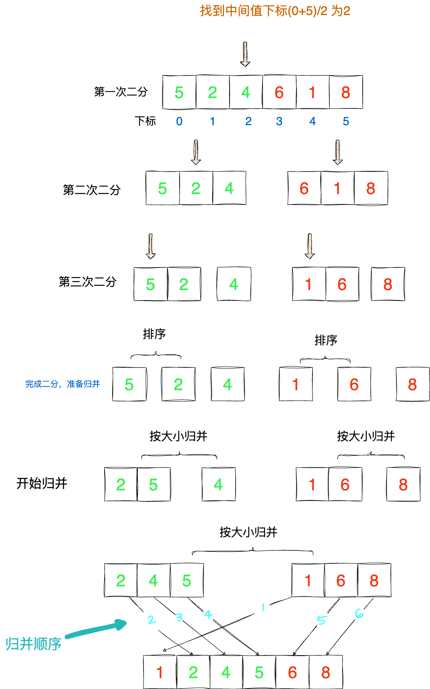

# 归并排序

> 归并排序和快速排序都是二分算法，但是要区分这两种算法，有一个明显的差别，归并是不断的二分，不做任何事，直到最后一个，最后左右两边比较大小，排序。快速排序是找到二分基准点后，把小于基准点的放左边，大于基准点的放右边，然后再去二分，直到排序完成。

## 算法模板

如果用二叉树来描述两种排序的话，归并排序是后序遍历，快速排序是前序遍历。

归并排序的步骤：

1. 将数组分成两半，分别对这两半进行归并排序。
2. 然后将两个有序数组合并成一个有序数组。

快速排序的步骤：

1. 选择一个基准点，通常是数组的第一个元素或者最后一个元素。
2. 遍历数组，将小于基准点的元素放左边，大于基准点的元素放右边。
3. 然后对左边和右边分别进行快速排序。


## 图解




## 代码实现

```js
/**
 *
 * @param {number[]} arr 未排序的数组
 * @param {number} low 起始下标
 * @param {number} high 结束下标
 * @returns {number[]} 排好序的数组
 */
function mergeSort(arr) {
  let temp = arr.slice();
  // 不断二分
  function divide(low, high) {
    // 二分停止条件：low 和 high 相等,只有一个元素不需要再二分
    if (low === high) return;
    // 找出中间值
    const mid = (low + high) >> 1;
    // 1.把数组不断二分
    divide(low, mid);
    divide(mid + 1, high);
    // 2.调用合并函数
    merge(low, mid, high);
    return arr;
  }

  /**
   *
   * @param {numer[]} arr
   * @param {number} low
   * @param {number} mid
   * @param {number} high
   */
  function merge(low, mid, high) {
    for (let i = low; i <= high; i++) {
      temp[i] = arr[i];
    }

    let p = low,
      p1 = low,
      p2 = mid + 1;
    while (p1 <= mid && p2 <= high) {
      arr[p++] = temp[p1] < temp[p2] ? temp[p1++] : temp[p2++];
    }

    while (p1 <= mid) {
      arr[p++] = temp[p1++];
    }

    while (p2 <= high) {
      arr[p++] = temp[p2++];
    }
  }
  divide(0, arr.length - 1);
  return arr;
}

console.log(mergeSort([6, 2, 5, 3, 4, 8], 0, 5));

```

## 总结

归并的时间复杂度是 O(nlogn)，快速排序的时间复杂度是 O(nlogn)，但是归并排序的空间复杂度是 O(n)，快速排序的空间复杂度是 O(logn)，所以归并排序适合对内存要求比较苛刻的场景，快速排序适合对时间要求比较苛刻的场景。

> tips: 内部排序指的是排序算法在排序过程中不占用额外的内存，只需要在原数组上进行操作。


归并排序可以理解为二叉树的后序遍历，要整个二叉树遍历完才会进行排序操作。快速排序可以理解为二叉树的前序遍历，只需要遍历一部分即可进行排序操作。