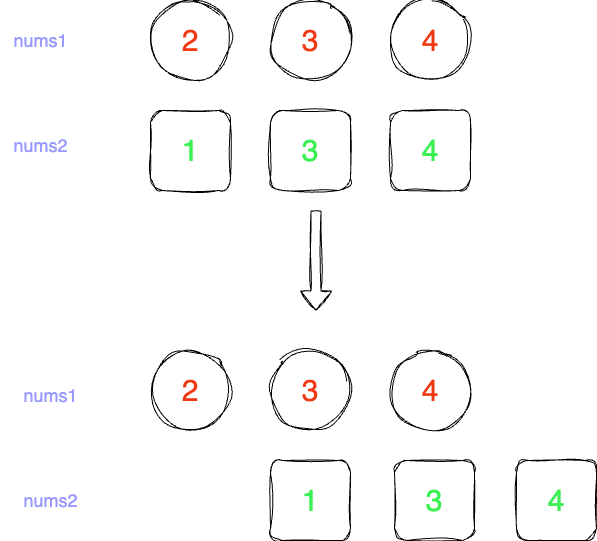

# 优势洗牌（田忌赛马）

LeetCode 第 870 题。[优势洗牌](https://leetcode-cn.com/problems/advantage-shuffle/)

## 题目描述


给定两个长度相等的数组 `nums1` 和 `nums2，nums1` 相对于 nums2 的优势可以用满足 `nums1[i] > nums2[i]` 的索引 `i` 的数目来描述。

返回 `nums1` 的任意排列，使其相对于 `nums2` 的优势最大化。

 
示例 1：
```
输入：nums1 = [2,7,11,15], nums2 = [1,10,4,11]
输出：[2,11,7,15]
```

示例 2：

```
输入：nums1 = [12,24,8,32], nums2 = [13,25,32,11]
输出：[24,32,8,12]
 
```
提示：


* `1 <= nums1.length <= 105`
* `nums2.length == nums1.length`
* `0 <= nums1[i], nums2[i] <= 109`


## 问题分析
参考下图，排好序如果 `nums1` 的起始值较小，就把 `nums1` 的第二位对其 num2 的第一位，以此类推。



可以看到，利用错位优势，可以使得 `nums1` 的值尽可能大，因此我们可以使用贪心算法来解决这个问题。

1. 这问题和田忌赛马相似，首先需要把 `nums1` 和 `nums2` 排序：`nums1 [2,3,4]` `nums2: [1,3,4]`
2. 从头对比，如果左边 `nums` 1 大于了 `nums2`，那么左指针就向前进一步，如果没有，就把值放到最后，右指针向前进一步，因为这个值已经不可能比 `nums2` 的值大了，放在最后和 `nums2` 去对比，就可以保证 `nums1` 的值尽可能大。


## 解题思路
1. 首先对 `nums1` 和 `nums2` 进行排序
2. 初始化左右指针
3. 初始化结果数组
4. 遍历 `nums1`，如果左指针的值大于右指针的值，就把值放到结果数组的最后，否则就放到结果数组的最前面
5. 返回结果数组

## 代码实现

```js

var advantageCount = function (nums1, nums2) {
  // 两个数组升序排序后的对应的旧的索引值
  const n = nums1.length;
  const idx1 = new Array(n).fill(0);
  const idx2 = new Array(n).fill(0);
  for (let i = 0; i < n; i++) {
    idx1[i] = i;
    idx2[i] = i;
  }
  // 对两个数组升序排序后对应的原数组索引
  idx1.sort((a, b) => nums1[a] - nums1[b]);
  idx2.sort((a, b) => nums2[a] - nums2[b]);
  // 结果数组存放
  const result = [];
  // 左右指针
  let left = 0;
  let right = n - 1;
  // 结果数组指针 用于迭代数组
  let pIdx = 0; 
  // left + right === n
  while (left <= right) {
    // nums1 大于 nums2，放入结果数组，nums2 对应索引
    if (nums1[idx1[pIdx]] > nums2[idx2[left]]) {
      // 找到对应位置的 nums2 的索引，赋值
      result[idx2[left++]] = nums1[idx1[pIdx]];
    } else {
      // 丢到最后，利益最大化，相当于 nums1 的下等马 对 nums2 的上等马
      result[idx2[right--]] = nums1[idx1[pIdx]];
    }
    pIdx++;
  }
  return result;
};

```