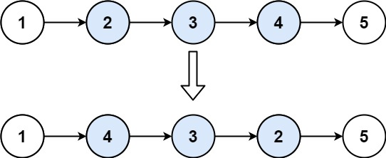

# 4. 反转链表


[LeetCode 92 题反转链表 II](https://leetcode.cn/problems/reverse-linked-list-ii/description/)


<!-- :::tip -->
给你单链表的头指针 head 和两个整数 left 和 right ，其中 left <= right 。请你反转从位置 left 到位置 right 的链表节点，返回 反转后的链表 。
 

示例 1：


```text
输入：head = [1,2,3,4,5], left = 2, right = 4
输出：[1,4,3,2,5]
```
示例 2：

```
输入：head = [5], left = 1, right = 1
输出：[5]
```


<!-- ::: -->

为了降低难度循序渐进，我们先看完整的反转一个链表思路，把后面一个节点指向前一个节点（head.next = head ） 即可，但是编写的时候需要注意，断开旧的链接之前，需要先保留的 next 节点

```js
// 反转链表 迭代
function reverse(head){
  // 如果没有头节点或者只有一个节点，直接返回
  if(!head || !head.next) return head;
  // 定义三个指针，pre, cur, next
  let pre = null, cur = head, next = null;
  // 当前移动的的节点不为空
  while(cur){
    // 断开旧的链接之前，需要先保留的 next 节点
    next = cur.next;
    // 当前节点指向上一个节点
    cur.next = pre;
    // 当前节点变成前任
    pre = cur;
    // 往后移动找下一任
    cur = next;
  }
  // pre 代表着最后一个有值节点，因为 cur 为空，代表到达链表末端
  return pre;
}
```


### 反转前 N 个节点

这个可以理解为反转链表的一个子问题，我们可以通过递归的方式来解决这个问题，递归的终止条件是 n = 1，也就是反转一个节点的时候，我们需要记录下一个节点，然后反转当前节点，最后返回下一个节点。


#### 1 .递归反转前 N 个节点

递归

```js

var successor = null; // N + 1 个节点

// 反转以 head 为起点的 n 个节点，返回新的头结点
function reverseN(head, n) {
    if (!head || !head.next) return head;
  // n == 1 时，到达反转的终点
    if (n == 1) {
        // 记录第 n + 1 个节点，后续要连接反转后的链表
        successor = head.next;
        // 当前 head 为反转后的链表头
        return head;
    }
    // 递归直到 n == 1，返回新的头结点
    var last = reverseN(head.next, n - 1);

    // 有点像中间件，每次递归返回的时候，都会执行这个操作，当前节点的下一个节点指向当前节点
    // 如何保证这是反转前的节点呢，因为递归后半部分是从后往前的，所以这里的反转是倒着的
    head.next.next = head;
    // 让反转之后的 head 节点和后面的节点连起来
    head.next = successor;
    // 返回反转后的头结点
    return last;
}

``` 

#### 2. 迭代递归反转前 N 个节点

```js
  function reverseN(head, n) {
    // 如果没有头节点或者只有一个节点，直接返回，没有反转的必要
    if (!head || !head.next) return head;
    // 定义三个指针，pre, cur, next
    let pre = null,
      cur = head,
      next = null;
      // 当前移动的的节点不为空并且 n 不为 0，cur 为空代表到达链表末端，n 为 0 代表反转完成
    while (cur && n) {
      // 保留下一个节点
      next = cur.next;
      // 当前节点反转到前一个节点
      cur.next = pre;
      // 当前节点变成前一个节点
      pre = cur;
      // 当前节点变成下一个节点
      cur = next;
      // n 计数减一
      n--;
    }
    // 连接反转后的链表和剩余的链表
    head.next = next;
    // 返回反转后的头结点
    return pre;
  }
```


最后就是我们 Leetcode 的 92 题的解法：

```js
/**
 * @param {ListNode} head
 * @param {number} left
 * @param {number} right
 * @return {ListNode}
 */
var reverseBetween = function (head, left, right) {
  // 左右相等，直接返回
  if (left === right) return head;
  // 如果 left 等于 1，转化为为反转前 N 个节点
  if (left === 1) return reverseN(head, right);

  /**
   * 这里就不加注释了
   * 参考上面的反转前 N 个节点
   */
  function reverseN(head, n) {
    if (!head || !head.next) return head;
    let pre = null,
      cur = head,
      next = null;
    while (cur && n) {
      next = cur.next;
      cur.next = pre;
      pre = cur;
      cur = next;
      n--;
    }
    head.next = next;
    return pre;
  }
  // p 为迭代到 left 的节点
  let p = head;
  // 设置为 left - 1 节点，因为要连接反转后的链表，所以要找到 left - 1 节点
  while (left > 2) {
    left--;
    right--;
    p = p.next;
  }
  // p 为 left 前一个节点，next 为 left 节点
  const next = p.next;
  // 反转以left 为起点的 当前 right - 1 个节点
  const reverseHead = reverseN(next, right - 1);
  // p 为 left 前一个节点，reverseHead 为反转后的头节点，连接起来
  p.next = reverseHead;
  return head;
};

```


> 参考 [反转单链表](https://labuladong.online/algo/data-structure/reverse-linked-list-recursion/#%E4%BA%8C%E3%80%81%E5%8F%8D%E8%BD%AC%E9%93%BE%E8%A1%A8%E5%89%8D-n-%E4%B8%AA%E8%8A%82%E7%82%B9)