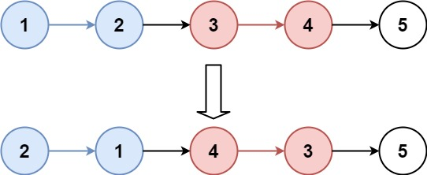
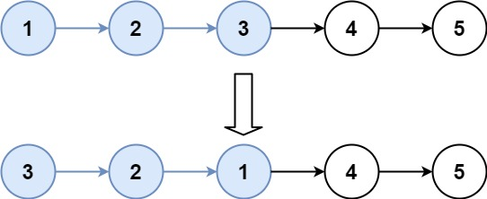

6.K个一组反转链表

LeetCode [25. K 个一组翻转链表](https://leetcode-cn.com/problems/reverse-nodes-in-k-group/)

## 题目描述

给你链表的头节点 head ，每 k 个节点一组进行翻转，请你返回修改后的链表。

k 是一个正整数，它的值小于或等于链表的长度。如果节点总数不是 k 的整数倍，那么请将最后剩余的节点保持原有顺序。

你不能只是单纯的改变节点内部的值，而是需要实际进行节点交换。

 

**示例 1：**



输入：head = [1,2,3,4,5], k = 2

输出：[2,1,4,3,5]

**示例 2：**



输入：head = [1,2,3,4,5], k = 3
输出：[3,2,1,4,5]
 

**提示：**
- 链表中的节点数目为 n
- 1 <= k <= n <= 5000
- 0 <= Node.val <= 1000
 

`进阶：你可以设计一个只用 O(1) 额外内存空间的算法解决此问题吗？`

## 解题思路

### 思路一：

我们每次翻转 K 个节点前，可以使用一个函数用于判断剩余节点是否足够翻转，如果不够翻转，则直接返回原链表；如果足够，返回翻转链表后的头节点和尾节点。

```js
/**
 * @param {ListNode} head
 * @param {number} k
 * @return {ListNode}
 */
var reverseKGroup = function (head, k) {
  // 处理边界条件
  if (!head.next) return head;
  // 翻转以p 为头的前 n 个节点
  function reverseN(p, n) {
    let cur = p;
    let next;
    let pre = null;
    for (let i = 1; i <= n; i++) {
      next = cur.next;
      cur.next = pre;
      pre = cur;
      cur = next;
    }
    // 假设原来 3-4-5,3,4 翻转后为 4-3,3需要指向 5，下面这行代码就是这个作用
    p.next = cur;
    // 返回翻转后的头节点和尾节点
    return [pre, p];
  }

// 获取下一个需要翻转的头节点
  function getNextHead(head, n) {
    let count = 0;
    while (head) {
      count++;
      if (count === n) {
        break;
      }
      head = head.next;
    }
    return head;
  }

  let p = head;
  let preEnd;
  let firstHead;
  while (p) {
    const nextp = getNextHead(p, k);
    const next = nextp?.next;
    // nextp 有值，说明 k 个节点可以翻转
    if (nextp) {
      // 获取翻转后的头尾节点
      const [start, end] = reverseN(p, k);
      // 记录头节点
      if (!firstHead) {
        firstHead = start;
      }
      // 记录尾节点，连接到新翻转的头节点
      if (preEnd) {
        preEnd.next = start;
      }
      // 尾节点记录
      preEnd = end;
      // 指针移动到下一个需要翻转的头节点
      p = next;
    } else {
    // nextp 为 null 表示剩余节点不够翻转 直接结束即可
      break;
    }
  }
  return firstHead;
};
```

这个解法主要是两个核心点，第一个是每k个节点翻转后，头尾需要正确的连接，第二个是记录翻转后的头尾节点，方便连接到下一次翻转。

### 思路二：

这个方法使用递归，我们递归翻转 head 开头的 n 个节点，返回新的头节点，新的头节点等于递归返回的节点。

- 设计一个函数，翻转 a 到 b 区间的元素，返回新的头节点
- 递归翻转 head 后面的 k 个节点，返回新的头节点
- 连接 a 到递归返回的节点，返回新的头节点


```js
function reverse(a, b) {
  let pre = null,
    cur = a,
    next;

  while (cur !== b) {
    // 存储下一个
    next = cur.next;
    // 修改当前的 next 指向 pre
    cur.next = pre;
    // pre 指向当前
    pre = cur;
    // cur 指向下一个
    cur = next;
  }
  return pre;
}

var reverseKGroup = function (head, k) {
  // 空值处理
  if (head === null) return head;
  // reverse a,b 区间的元素
  // 区间节点 b是下一组的头节点
  let a, b;
  // 开始默认头节点
  a = b = head;
  // b 往后走，看看是否够 k 个
  for (let i = 0; i < k; i++) {
    if (b === null) return a;
    b = b.next;
  }
  let newhead = reverse(a, b);

  // a 的 next 指向下一个头节点
  a.next = reverseKGroup(b, k);
  return newhead;
};

```