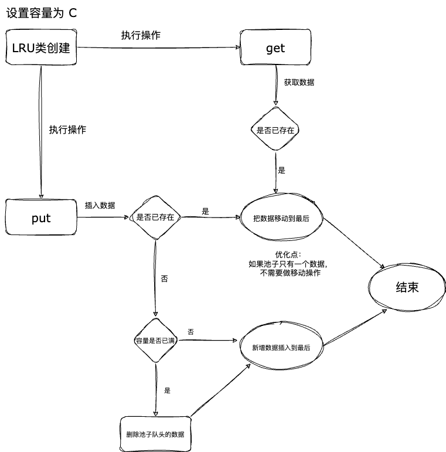
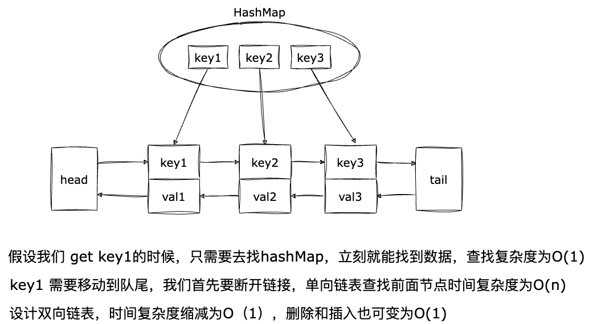

# 7、LRU算法

LeetCode [146.LRU 缓存](https://leetcode-cn.com/problems/lru-cache/)


请你设计并实现一个满足  LRU (最近最少使用) 缓存 约束的数据结构。
实现 LRUCache 类：
- LRUCache(int capacity) 以 正整数 作为容量 capacity 初始化 LRU 缓存
- int get(int key) 如果关键字 key 存在于缓存中，则返回关键字的值，否则返回 -1 。
- void put(int key, int value) 如果关键字 key 已经存在，则变更其数据值 value ；如果不存在，则向缓存中插入该组 key-value 。如果插入操作导致关键字数量超过 capacity ，则应该 逐出 最久未使用的关键字。
- 函数 get 和 put 必须以 O(1) 的平均时间复杂度运行。

 

**示例：**

输入
```
["LRUCache", "put", "put", "get", "put", "get", "put", "get", "get", "get"]
[[2], [1, 1], [2, 2], [1], [3, 3], [2], [4, 4], [1], [3], [4]]
输出
[null, null, null, 1, null, -1, null, -1, 3, 4]
```

解释

```
LRUCache lRUCache = new LRUCache(2);
lRUCache.put(1, 1); // 缓存是 {1=1}
lRUCache.put(2, 2); // 缓存是 {1=1, 2=2}
lRUCache.get(1);    // 返回 1
lRUCache.put(3, 3); // 该操作会使得关键字 2 作废，缓存是 {1=1, 3=3}
lRUCache.get(2);    // 返回 -1 (未找到)
lRUCache.put(4, 4); // 该操作会使得关键字 1 作废，缓存是 {4=4, 3=3}
lRUCache.get(1);    // 返回 -1 (未找到)
lRUCache.get(3);    // 返回 3
lRUCache.get(4);    // 返回 4
```
 

**提示：**

- 1 <= capacity <= 3000
- 0 <= key <= 10000
- 0 <= value <= 105
- 最多调用 2 * 105 次 get 和 put


## 分析和图解

### LRU 简介
LRU算法（Least Recently Used，最近最少使用）是一种缓存淘汰算法，其核心思想是如果一个数据最近被访问过，那么将来被访问的可能性也更高，所以应当将其排在缓存列表的头部。当缓存空间已满时，LRU算法将删除最久未被访问的数据，即将缓存列表的尾部的数据删除。

如果不考虑O(1)复杂度的要求，我们可以使用数组存储缓存数据，当数组的大小超过容量的时候，我们把数组最前面的删除，就能够实现这个要求，但是数组的删除操作的时间复杂度是O(n)，所以不满足O(1)的时间复杂度要求，当然我们可以做移动操作，把将要废弃的数据移动到数组的尾部，这样就可以在O(1)的时间复杂度内删除数据，但是要借助额外的映射去记录数据在数组中的位置，这样的实现和下面要说到的LinkHashMap的实现方式有些类似。

现在题目要求O(1)的平均时间复杂度，那么我们需要设计一种数据结构，能够在O(1)的时间复杂度内完成get和put操作。

### 分析
1. 题目要求有最大容量，那么需要设计一个容量池，用于插入，移动，删除数据。
2. 当执行 get 方法时，如果没有找到数据，则返回 -1。 如果有，则需要把当前数据移动到最后，并返回数据。
3. 当执行 put 方法时，如果数据已经存在，则需要更新数据，并移动到最后。 如果数据不存在，则需要判断容量是否已满，如果满了，则需要删除最久未被访问的数据。
  
我们来看一下运行逻辑图：



这样我们的流程梳理清楚了，让我们来看题目的一个重要的要求，O(1)的时间复杂度。

1. 假设池子使用数组来实现，当 get 的时候，需要遍历数组找到对应的数据，最坏的情况下，时间复杂度是O(n)，明显一个数组无法实现O(1)的时间复杂度;
2. 可以做一个映射表，类似索引，当 get 的时候，通过映射表找到对应的数据，时间复杂度是O(1)；
3. 使用数组有另外一个问题，当删除数据的时候，数组的删除操作的时间复杂度是O(n)，所以需要做一些优化;
4. 使用双向链表来实现，当删除数据的时候，只需要把当前节点的前后指针指向当前节点的前后节点，不需要移动数组中的数据，这样就可以在O(1)的时间复杂度内删除数据;
5. 用双向链表去代替数组;

使用 `HashMap` + `双向链表`，这样就可以在O(1)的时间复杂度内完成get和put操作，这种数据结构称为 `LinkHashMap，`
来看这种数据结构的图解：




`LinkHashMap` 这种数据结构解决了两个问题：
1. 使用 `HashMap` 解决查找复杂度的问题，通过 key 直接找到对应的节点，时间复杂度是 O(1);
2. 使用双向链表解决删除复杂度的问题，通过 prev 和 next 指针，在 O(1) 的时间复杂度内删除节点，不需要移动数组中的数据。


## 代码逐步分析实现

### 实现一个双向链表
通过流程分析图可以看到 put 和 get 都需要把最近访问的数据移动到最后，那么链表需要提供一个功能用于把节点插入到尾部。并且为了防止频繁处理边界条件，设计了一个虚拟头节点和尾节点。

```js
var Node = function (key, val) {
  this.key = key;
  this.val = val;
  this.next = null;
  this.prev = null;
};

var DoubleList = function () {
  // 虚拟头尾节点
  this.head = new Node(0, 0);
  this.tail = new Node(0, 0);
  this.head.next = this.tail;
  this.tail.prev = this.head;
  this.size = 0;
};

// 添加一个节点到链表头部
DoubleList.prototype.addFirst = function (node) {
  const oldNext = this.head.next;
  this.head.next = node;
  node.prev = this.head;
  node.next = oldNext;
  oldNext.prev = node;
  this.size++;
};

// 添加一个节点到链表尾部
DoubleList.prototype.addLast = function (node) {
  const oldPrev = this.tail.prev;
  oldPrev.next = node;
  node.prev = oldPrev;
  node.next = this.tail;
  this.tail.prev = node;
  this.size++;
};

// 删除指定节点
DoubleList.prototype.remove = function (node) {
  if (!node) return;
  node.prev.next = node.next;
  node.next.prev = node.prev;
  node.prev = null;
  node.next = null;
  this.size--;
};

// 删除并返回链表头部的第一个节点
DoubleList.prototype.removeFirst = function () {
  if (this.size === 0) return null;
  const first = this.head.next;
  this.remove(first);
  return first;
};
```
### 初始化构造函数

初始化一个容量，一个缓存 `cache`,一个双向链表，

```js
/**
 * @param {number} capacity
 */
var LRUCache = function (capacity) {
  // 容量控制
  this.capacity = capacity;
  // 创建一个linkhashList
  this.cache = new Map();
  this.appList = new DoubleList();
};
```

### 把当前节点移动到最后

当执行 put 或者 方法时，如果数据已经存在，则需要更新数据，并移动到最后。 

```js
/**
 * 把当前节点移动到最后
 * @param {*} app
 */
LRUCache.prototype.moveRecent = function (app) {
  //如果节点已经存在，先删除
  if (this.cache.has(app.key)) {
    if (this.appList.size === 1) return;
    this.appList.remove(app);
  }
  this.cache.set(app.key, app);
  this.appList.addLast(app);
};
```

### get 方法

当执行 get 方法时，如果没有找到数据，则返回 -1。 如果有，则需要把当前数据移动到最后，并返回数据。

```js
/**
 * @param {number} key
 * @return {number}
 */
LRUCache.prototype.get = function (key) {
  if (!this.cache.has(key)) return -1;
  const app = this.cache.get(key);
  this.moveRecent(app);
  return app.val;
};
```


### put 方法

当执行 put 方法时，如果数据已经存在，则需要更新数据，并移动到最后。 如果数据不存在，则需要判断容量是否已满，如果满了，则需要删除最久未被访问的数据。

```js
/**
 * @param {number} key
 * @param {number} value
 * @return {void}
 */
LRUCache.prototype.put = function (key, val) {
  // 如果 key 存在，直接移动到最后
  if (this.cache.has(key)) {
    const app = this.cache.get(key);
    app.val = val;
    this.moveRecent(app);
    return app;
  }
  // 剩下的场景为 key 不存在，新建一个节点
  // 1. 判断是否超出容量
  if (this.appList.size === this.capacity) {
    const first = this.appList.removeFirst();
    this.cache.delete(first.key);
  }
  const newNode = new Node(key, val);
  // 2. 加入到链表尾部
  this.moveRecent(newNode);
  return newNode;
};
```


## 完整代码
```js

var Node = function (key, val) {
  this.key = key;
  this.val = val;
  this.next = null;
  this.prev = null;
};

var DoubleList = function () {
  // 虚拟头尾节点
  this.head = new Node(0, 0);
  this.tail = new Node(0, 0);
  this.head.next = this.tail;
  this.tail.prev = this.head;
  this.size = 0;
};

// 添加一个节点到链表头部
DoubleList.prototype.addFirst = function (node) {
  const oldNext = this.head.next;
  this.head.next = node;
  node.prev = this.head;
  node.next = oldNext;
  oldNext.prev = node;
  this.size++;
};

// 添加一个节点到链表尾部
DoubleList.prototype.addLast = function (node) {
  const oldPrev = this.tail.prev;
  oldPrev.next = node;
  node.prev = oldPrev;
  node.next = this.tail;
  this.tail.prev = node;
  this.size++;
};

// 删除指定节点
DoubleList.prototype.remove = function (node) {
  if (!node) return;
  node.prev.next = node.next;
  node.next.prev = node.prev;
  node.prev = null;
  node.next = null;
  this.size--;
};

// 删除并返回链表头部的第一个节点
DoubleList.prototype.removeFirst = function () {
  if (this.size === 0) return null;
  const first = this.head.next;
  this.remove(first);
  return first;
};
/**
 * @param {number} capacity
 */
var LRUCache = function (capacity) {
  // 容量控制
  this.capacity = capacity;
  // 创建一个linkhashList
  this.cache = new Map();
  this.appList = new DoubleList();
};

/**
 * @param {number} key
 * @return {number}
 */
LRUCache.prototype.get = function (key) {
  if (!this.cache.has(key)) return -1;
  const app = this.cache.get(key);
  this.moveRecent(app);
  return app.val;
};

/**
 * @param {number} key
 * @param {number} value
 * @return {void}
 */
LRUCache.prototype.put = function (key, val) {
  // 如果 key 存在，直接移动到最后
  if (this.cache.has(key)) {
    const app = this.cache.get(key);
    app.val = val;
    this.moveRecent(app);
    return app;
  }
  // 剩下的场景为 key 不存在，新建一个节点
  // 1. 判断是否超出容量
  if (this.appList.size === this.capacity) {
    const first = this.appList.removeFirst();
    this.cache.delete(first.key);
  }
  const newNode = new Node(key, val);
  // 2. 加入到链表尾部
  this.moveRecent(newNode);
  return newNode;
};

/**
 * 把当前节点移动到最后
 * @param {*} app
 */
LRUCache.prototype.moveRecent = function (app) {
  //如果节点已经存在，先删除
  if (this.cache.has(app.key)) {
    if (this.appList.size === 1) return;
    this.appList.remove(app);
  }
  this.cache.set(app.key, app);
  this.appList.addLast(app);
};
```

## 总结

本文介绍了 LRU 缓存算法，并通过分析和图解，使用 `HashMap` + `双向链表`，两种实现方式都能在 O(1) 的时间复杂度内完成 get 和 put 操作，并解决了删除操作的时间复杂度问题。
画出来 LRU 算法的流程图，以及 `HashMap` + `双向链表` 两种数据结构的实现后，才能对 LRU 算法有更深刻的理解。