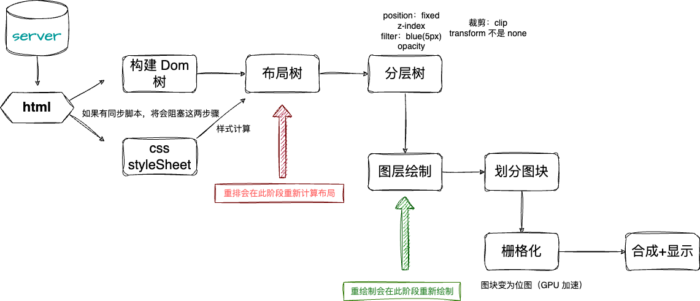

# 4.前端性能优化

前端性能优化无非是优化服务器加载 HTML 到 生成页面的过程，当然我们说的是传统的 web 页面，小程序，APP 的方向不太一样，可以单独开一个话题，这里主要介绍一下 web 前端性能优化的一些常用方法。

我们先来看一张浏览器渲染页面的流程图：




## Chrome 性能指标

- FP First Paint 首次绘制，标记页面第一次绘制像素的时间，比如页面的背景色
- FCP  First Contentful Paint 首次内容绘制，如最大文本块或者图片显示到页面的时间，2s 内完成算优秀
- LCP  Largest Contentful Paint 最大内容绘制，记录视窗内最大元素的绘制时间，并随着时间变化而变化（因为最大元素会随着页面变化而改变），另外会在用户第一次交互后停止记录，2.5s内算优秀
- TTI  Time to Interactive 可交互时间，记录页面的可交互时间
- FID First Input Delay 首次输入延迟，记录用户第一次输入响应的时间，记录在 FCP 到 TTI 之间，交互相应延迟
- CLS  Cumulative Layout Shift 累积布局偏移，记录页面布局变化的累积量，布局偏移越大，页面加载速度越慢，CLS 指标越高

在这些指标里面，有比较核心的几个指标用于判断页面性能：

LCP、FID、CLS，最大内容绘制影响用户的第一感知，用户输入延迟影响用户的交互体验，累积布局偏移影响用户的阅读体验。

### LCP （最大内容绘制）性能指标

最大内容绘制，那些元素会影响 LCP 呢？

- img 标签
- svg 内的 image 标签
- video 标签
- css 的 background-image
- 包含文本节点或者其他内嵌文本子元素的块级元素

如果要在 JS 中触发 LCP，可以用以下方式：

```javascript
const observer = new PerformanceObserver((list) => {
  const entries = list.getEntries();
  entries.forEach((entry) => {
    if (entry.entryType === 'largest-contentful-paint') {
      console.log('LCP', entry.startTime, entry);
    }
  });
});
observer.observe({ type: 'largest-contentful-paint', buffered: true });
```

如何优化 LCP ？

参考渲染流水线图，我们的 FCP 是在图层绘制阶段，这个阶段之前我们都有优化的机会：

- 压缩 css 的体积，推迟非关键 css
- 内联样式，减少请求
- 推迟脚本加载和执行
- SSR 服务端渲染

### FID （用户输入延迟）性能指标
衡量用户首次与网页互动（输入，点击，滚动等）浏览器的响应时间，FID 越低，用户体验越好。

```javascript
const observer = new PerformanceObserver((list) => {
  const entries = list.getEntries();
  entries.forEach((entry) => {
    if (entry.entryType === 'first-input') {
      console.log('FID', entry.processingStart - entry.startTime, entry);
    }
  });
});
observer.observe({ type: 'first-input', buffered: true });
```

如何优化 FID ？

- 减少脚本执行时间，优化脚本执行效率
- 减少收评请求数和文件大小
- 防止回流

### CLS （累积布局偏移）性能指标

CLS 衡量页面布局的连续性，CLS 越低，页面的加载速度越快。

为了计算布局偏移得分，浏览器会考虑视口大小，以及视口中不稳定元素在两个渲染帧之间的移动。布局偏移分数是该移动的两种度量的乘积：影响分数和距离分数。

比如首帧渲染图片在顶部，下一帧图片移动到了底部，那么布局偏移分数就是影响分数（图片移动了位置）乘以距离分数（图片移动了整个视口）。

```javascript
const observer = new PerformanceObserver((list) => {
  const entries = list.getEntries();
  entries.forEach((entry) => {
    if (entry.entryType === 'layout-shift') { 
      console.log('CLS', entry.value, entry);
    }
  });
});
observer.observe({ type: 'layout-shift', buffered: true });
```


如何优化 CLS ？

- 避免布局抖动，减少布局复杂度
- 初始化的位移，可以使用 transform 添加，不会触发布局偏移

总结：

- 做性能优化之前，优先使用 LightHouse 等工具进行测试，找出瓶颈点
- 使用 PageSpeed Insights 分析网站性能，找出优化的方向
- 使用Chrome User Experience Report API 获取网站用户的真实体验数据
- 也可以使用 Performance 面板查看页面的性能指标，分析出哪些地方需要优化


## 前端性能优化方案

**我们回顾下面这张图：**


### 1. 减少 HTTP 请求

在从服务器请求 HTML 到生成页面的过程中，HTTP 请求是影响性能的主要因素。

- CDN 加速，减少不同地区的链路延迟
- 请求协议升级 http2 ,http2优势：二进制传输，多路复用，减少 TCP 连接，首部压缩，服务器推送（请求 HTML 的时候可以把 CSS，JS，图片等资源一起请求）
- 代码压缩（webpack 压缩插件，terser），gzip压缩
- 图片懒加载 lazy-load，使用 IntersectionObserver API 实现图片懒加载
- 图片使用 webp，并使用回退模式（浏览器请求头）
- 启用 http 缓存（no-cache 是重新验证缓存，no-store 表示永远不使用缓存）

### 2. JS 优化

- 使用模块化开发，避免全局污染，并能做到按需加载和 tree-shaking
- 懒加载路由，动态导入组件
- 开启层叠上下文分层渲染，如 transform，z-index 等属性，避免重绘和回流
- iconfont 字体图标，使用字体文件压缩，减少请求数


## 总结

前端性能优化是一个长期的过程，需要不断的学习和实践，才能提升用户的体验。

我们可以从流水线图中去获取优化方案，比如获取 html，可以从网络（CDN），缓存，压缩去做优化，并且在请求的时候去除未用到 的资源，做懒加载，如路由懒加载，图片懒加载等，在新技术方面，http2，webp 图片也是不错的方案。
渲染的时候尽量减少 js 对渲染主进程的阻塞，如使用 web worker，异步加载，懒加载组件等。

加载完整后，可以从浏览器的渲染着手优化，如分层，减少重绘，回流，使用 webgl，css 动画，使用 IntersectionObserver API 实现图片懒加载等。